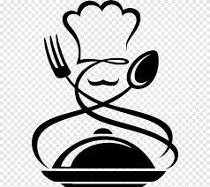

===================================
🍴   RESTAURANTES   🍴
===================================

Contents
--------

.. toctree::
   :maxdepth: 1
   burgers
   italian
   api

Asiático 

🍣Kamon 
🍣Komori
🍣Sushi cru
🍣Tastem 
🍣Sushi room 
🍣Sushi shop
🍣Miss Sushi 
🍣Sushi point 
🍣Aoyama ✅
🍣Nagato 
🍣Don Sushi 
🍣Kokura (bien de precio en el Carmen)
🍣 Akira
🍣 Sushi do ✅
🍣 Hanazono (benimaclet)
🍣 Sushitok (Alfafar)
🍣 Kiyoki 
🍣 Samurái ✅
🍣 Ashita ✅
🍣 Fuji ✅
🍣 Nozomi sushi bar
🍣 Tora
🍣 Ryukisin
🍣 Udon
🍣 Kaori
🍣 Okay Lah
🍣 Hikari
🍣 Kento
🍣 Osaka
🍣 Kyoto
🍣 Kaikaya
🍣 Zen
🍣 Mioya
🍣 Colala
🍣 Shintori teppanyaki

🍜 Mei Chen (chino) 
🍜 Mey-Mey (chino) 
🍜 La gran Muralla(chino) 
🍜 Mei Hua (chino) 
🍜 Frenazo (chino)
🍜 Wok beijing
🍜 Restaurante nuevo siglo

🍛 Lemon Grass
🍛 Wok to walk
🍛 Delicat

Tapeo

Llebeig
Maria mandiles 
El rus
Vela
Canela
Nómada  
Bar Ricardo
Bar che taberna Vasca
Central Bar
Lotelito
La rentaora 
ca consuelo 
La pitusa 
La flamenca
Lateral 
El sitio 

Top Level / menús 🍴🍷
La salita
Nómada
Turqueta 
Tagomago 
Bocado
El Rausell
Vino tinto 
Barbados 
La Bona cuina
Rías Gallegas
Lateral
La principal
Panorama ✅
Canalla bistro 
Boix Quatre 
La Mary 
Voltereta 
Saona ✅

Almuerzos🥖

Tapas Holandesas: Bocadillos Gigantes
Bar Rojas Clemente
Vela 
Bar Alhambra
La Pascuala 
La Piulá (Especialidad: Bocata Calamares)
La Pérgola 
Bodega flor (al lado del mercado del cabanyal)
Marrakech 

De cerveceo

🍺La fábrica del hielo 
🍺Cómic
🍺Olhöps Craft Beer House

 Meriendas🥐🥞
giraffe (se puede comer y cenar)
Dulce de leche
La más bonita 
La manera coffee & cocktails
Cereal house valencia 
Cappuccino Grand café 
Mamá delicias
Icecobar
La petite brioche
Cala bandida (Jávea)
Alma libre (el Carmen)
Bastard coffee (también se puede comer)
Blackbird cafe (cerca del Mercado de ruzafa)

Matahari
Marina Alta
La diva
Vegin
Voltereta

MEXICANOS
-La llorona
-La venganza de Malinche
-Casa Amores
-Tecolotes
-Beers & Burros
-Ameyal
-Enchilame
-Taqueria la llorona
-Taqueria sol azteca
-Vento DF

MARROQUÍES
-Sahara
-Balansiya
-Almunia
-Dukala 
-Aladwaq
-Leila

ARABE
-Maharaja
-La casa arabe
-Sish mahal
-Taj mahal

INDIA
🇮🇳El amarinder
🇮🇳Tandoor masala

VASCO
-Orio

HAWAII
-Poké Shop
-City poke
-Aloha poke

LIBANES
🇱🇧Beirut

PERU
🇵🇪Bouet (gran via germania) 

BRASIL
🇧🇷Xingu

GRIEGO
🇬🇷Kuzina

BARES CON JUEGOS
-café colores (cedro) 
-Cafe de las luces
-Bruixes i Fades

GRUPOS
-La pecera
-La lobera de Xiqui (cedro) 
-El Pato Mareao
-La Tasqueta del Mercat (ruzafa) 
-Las bestias (temático) 
-Todo Gigante
-Pan de Azúcar
-Red Cup
-Bocalinda

BUFET LIBRE
Colonial
Wok asador alfafar
Neco
